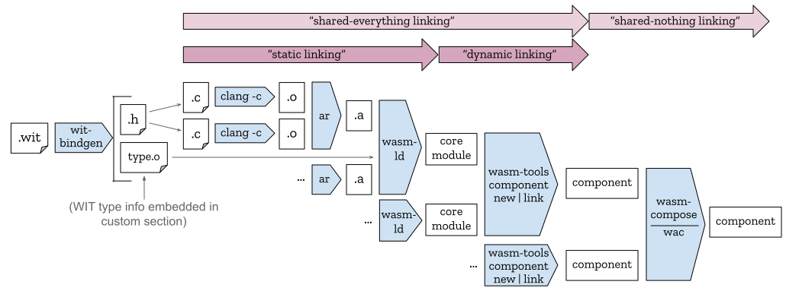

# Component Linking

The Component Model enables multiple complementary forms of linking which allow
producer toolchains to control which Core WebAssembly modules do or don't share
low-level memory. At a high-level, there are two primary axes of choices to
make when linking:
* **shared-everything** vs. **shared-nothing**:
* **inline** vs. **import**

When two modules are linked together to share Core WebAssembly `memory` and
`table` instances, it is called **shared-everything linking**. In this case,
the linked modules must have been compiled to agree on an implicit toolchain-
or language-defined [ABI]. As an example, two modules compiled against the
[WebAssembly/tool-conventions] C/C++ ABI could be shared-everything-linked
together.

When two modules that have been packaged as components are linked together, it
is not possible for them to share the same `memory` or `table` instances and so
this form of linking is called **shared-nothing linking**. In this case, the
modules need to agree on the component-level types that stand between them,
with each module being allowed to have a *different* ABI for producing and
consuming component-level values of the common component-level types.

A further sub-classification between **dynamic** and **static** is useful when
describing shared-everything linking:

In **shared-everything dynamic linking**, the producer toolchain keeps the Core
WebAssembly modules handed to the runtime separate, thereby allowing the
runtime to more-easily share the compiled machine code of common modules (such
as libc, libpython or libjpeg). Importantly, while this linking is "dynamic"
from the perspective of the producer of the individual modules, the set of
dynamically-linked modules is still *statically* declared to the runtime before
execution, allowing the runtime to perform traditional [AOT compilation] of
each module (separately). (For
[fully-runtime dynamic linking](#fully-runtime-dynamic-linking), see below.)

In **shared-everything static linking**, the producer toolchain eagerly fuses
intermediate units of WebAssembly code together to produce a *single* module
that is handed to the runtime. Since this form of linking is handled by the
producer toolchain, it's completely invisible to the Component Model and the
runtime and thus mostly only relevant when talking about entire end-to-end
workflows (like we'll do next).

Regardless of whether or not memory is shared when linking, when two (child)
modules or components are linked together to create a new (parent) component,
the Component Model gives two options for how the parent represents its
children:
* A parent component can **inline** its children, literally storing the child
  module or component binaries in a contiguous byte range inside the parent
  (via the `core:module` and `component` sections in the [binary format]).
* A parent component can **import** its children, using the import name to
  refer to modules or components stored in an external shared registry that is
  mutually known to later stages in the deployment pipeline (specifically with
  the [`depname`] case of `importname` in the text and binary format).

Given this terminology, the following diagram shows how the different forms of
linking can be used together in the context of C/C++:
<p align="center"></p>

Digging into the steps of this diagram in more detail:

The process starts by using a tool like [`wit-bindgen`] to generate C headers
that expose core function signatures derived from the [Canonical ABI]. WIT type
information that is needed later to build a component can be stored in a
[custom section] that will be opaquely propagated to the component-specific
tooling by the intervening Core WebAssembly build steps.

Next, each C/C++ translation unit is compiled to a [WebAssembly Object File]
using `clang`, optionally archived together using `ar`, and finally
**shared-everything statically-linked** using [`wasm-ld`], all without any of
these tools knowing about the Component Model.

A single Core WebAssembly module can be trivially wrapped into a component
using a tool like the [`wasm-tools`] `component new` command. Multiple Core
WebAssembly modules can be **shared-everything dynamically-linked** together by
a tool ike the `component link` command, which supports both loading modules into
linear memory automatically (in the style of `ld-linux.so`) or manually (in the
style of `dlopen()`). For a low-level sketch of how dynamic linking works at
the WAT level, see [this example](examples/SharedEverythingDynamicLinking.md).

Lastly, multiple components can be **shared-nothing-linked** together using
language-agnostic composition tools like [`wac`]. Since the output of
composition is itself a component, composite components can themselves be
further composed with other components. For a low-level sketch of how
shared-nothing linking works at the WAT level, see
[this example](examples/LinkTimeVirtualization.md).

With both `wasm-tools link` and `wac`, the developer will have the option to
either store child modules or components **inline** or to **import** them from
an external registry. This registry toolchain integration is still in progress,
but by reusing common support libraries such as [`wasm-pkg-tools`], higher-level
tooling can uniformly interact with multiple kinds of storage backends such as
local directories, [OCI Wasm Artifacts] stored in standard [OCI Registries]. Of
note, even when modules or components are stored inline by earlier stages of the
build pipeline, when creating an OCI Wasm Artifact, a toolchain can
(hypothetically, existing tools don't do this yet) enable deduplication by
content-hash of common modules or components by placing them in separate OCI
[`layers`] which are imported via [`hashname`] by the root component stored in
the first layer of the OCI Wasm Artifact.


## Higher-order Shared-Nothing Linking (aka "donut wrapping")

When using shared-nothing linking, the Component Model allows a traditional
"first-order" style of linking wherein one component's exports are supplied as
the imports of another component. This kind of linking captures the traditional
developer experience of package managers and package dependencies.

In WAT, a "first-order" dependency from `B` to `A` looks like:
```wat
(component $A
  ...
  (export "foo" (func $foo-internal) (func (result string)))
)
```
```wat
(component $B
  (import "A" (instance
    (export "foo" (func $foo-internal (result string)))
  ))
  ...
)
```

`A` can be linked to `B` either directly by the host (e.g., in browsers, using
`WebAssembly.instantiate` or [ESM-integration]) or by another parent component.
For example, the following parent component `P` links `A` and `B` together:
```wat
(component $P
  (import "A" (component $A (export "foo" (func (result string)))))
  (import "B" (component $B (import "A" (instance (export "foo" (func (result string)))))))
  (instance $a (instantiate $A))
  (instance $b (instantiate $B (with "A" (instance $a))))
)
```
Note that `P` is the "parent" of `A` and `B` because `P` `instantiate`s `A` and
`B`. Whether `P` physically contains the bytecode defining `A` and `B` (as
nested `(component ...)` definitions) or `import`s the `component` definitions,
as shown here, is an orthogonal *bundling* choice that does not affect runtime
behavior (as long as the bytecode is the same in the end).

When `P` is instantiated, the resulting 3 component instances can be visualized
as nested boxes:
```
+---------------+
|       P       |
| +---+   +---+ |
| | A |-->| B | |
| +---+   +---+ |
+---------------+
```
Since `A` and `B` can themselves have child components, boxes can nest and form
a tree. And since `instantiate` can refer to any preceding definition in the
component, the linkage within a single box forms a Directed Acyclic Graph (DAG).

With simpler "first-order" shared-nothing linking, the definitions of parent
components like `P` only contain component-level "linking" definitions
(like `import`, `export`, `alias`, `instance`) and not any Core WebAssembly
"implementation" definitions (like `canon lift` and `canon lower`). Thus `P`
disappears at runtime, with the compiler baking all of `P`'s linkage information
into the generated code and metadata. However, there is nothing to prevent
parent components from including *both* "linking" and "implementation"
definitions.

For example, a parent component `Q` can link a child component `C` to its own
lifted and lowered core wasm modules `M1` and `M2` as follows:
```wat
(component $Q
  (import "C" (component $C
    (import "foo" (func (result string)))
    (export "bar" (func (result string)))
  ))
  (core module $M1
    ...
    (export "foo-impl" (func ...))
  )
  (core instance $m1 (instantiate $M1))
  (canon lift (core func $m1 "foo-impl") (func $foo-impl (result string)))
  (instance $c (instantiate $C (with "foo" (func $foo-impl))))
  (canon lower (func $c "bar") (core func $bar))
  (core module $M2
    (import "c" "bar" (func ...))
    ...
  )
  (core instance $m2 (instantiate $M2 (with "c" (instance (export "bar" (func $bar))))))
)
```
This new, more complex instance graph can be represented diagrammatically as:
```
+----------------------------------------------------+
|                         Q                          |
| +-----------+         +---+          +-----------+ |
| | M1 (in Q) |--lift-->| C |--lower-->| M2 (in Q) | |
| +-----------+         +---+          +-----------+ |
+----------------------------------------------------+
```
The informal term **donut wrapping** is used to describe this more advanced kind
of linking where `Q` is the "donut" with a `C`-shaped donut hole in the middle
and with `M1` and `M2` serving as the toroidal dough. (In general, parent
components can have many child instances, arbitrarily linked together and to the
internal `lift` and `lower` definitions of the parent, so perhaps a different
metaphor than "donut" would be appropriate.)

Because parent components control all linkage of their children's imports and
exports, donut wrapping allows a parent component to run its own Core
WebAssembly code on all paths into and out of all child components, allowing the
parent to arbitrarily *virtualize* the execution environment of its child
components. This is analogous to how a traditional operating system kernel can
control how and when its user-space processes run and what happens when they
make syscalls.

What is particularly powerful about donut wrapping is that, since `M1` and `M2`
are both inside the same component instance, they can be linked together
directly (without intervening `lift` and `lower` definitions) which allows them
to share arbitrary Core WebAssembly definitions (like functions, linear memory,
tables and globals). For example, extending the above definition of `$Q`, `$M1`
could export its `memory` and `funcref` `table` directly to `$M2`:
```wat
(component $Q
  ...
  (core module $M1
    ...
    (memory $mem 0)
    (table $ftbl 0 funcref)
    (export "mem" (memory $mem))
    (export "ftbl" (table $ftbl))
  )
  (core instance $m1 (instantiate $M1))
  ...
  (core module $M2
    (import "m1" "mem" (memory 0))
    (import "m1" "ftbl" (table 0 funcref))
    ...
  )
  (core instance $m2 (instantiate $M2 (with "m1" (instance $m1))))
  ...
)
```

Once `M1` and `M2` share linear memory and table state, `M2` can import the
`canon lower`ed exports of the child component `C` and store them into `ftbl`,
so that `M1` can call `C`'s exports via `call_indirect`. This provides `Q` the
flexibility to put *all* its core wasm code in `M1` (using `M2` to only do
`funcref`-plumbing), which is convenient. But this also allows `M1` to attempt
to reenter `C` while `C` is calling an import of `M1`, which would violate
[Component Invariant] #2. To prevent this, the Canonical ABI must place runtime
guards in `lift` that trap if `M1` tries to recursively reenter `C`.

Similarly, donut wrapping allows `Q` to both define resource types that are
imported by `C` and consume resource types that are defined by `C`. This allows
`Q` to create ownership cycles with `C` which may lead to resource leaks that
would normally be prevented in non-donut-wrapping cases by the acyclicity of
component instantiation.

In both of the above problematic cases, the parent is responsible for "closing
the loop" to create the cycle and thus any bugs arising from cycles are, by
default, bugs in the parent. This asymmetry reflects the fact that, when
donut-wrapping, the parent component is taking on part of the role of the "host"
with the child component being the "guest". This is an asymmetric relationship
that gives the host greater power over the guest (e.g., to virtualize the
guest's execution environment), but with this greater power comes greater
responsibility to avoid creating cycles with the guest.


## Fully-runtime dynamic linking

While many use cases for dynamic linking are covered by what is described
above, there are still some use cases that require "fully-runtime" dynamic
linking where code is dynamically loaded that was not known (or may not have
even existed) when execution started.

One use case for fully-runtime dynamic linking is JIT compilation (where the
running WebAssembly code generates the bytecode to be linked). This is possible
in browsers today by having WebAssembly call into JS and using the [JS API].
Doing so from pure WebAssembly has been included in Core WebAssembly's list of
[future features][JIT Future Feature] since the beginning of WebAssembly.
This is a nuanced feature for many reasons including the fact that many
WebAssembly execution environments don't provide the raw OS primitives (viz.,
making writable pages executable) to enable a WebAssembly runtime to perform
the native JIT compilation necessary for performance. In any case, addressing
this use case is ideally outside the scope of the Component Model.

Another major use case for fully-runtime dynamic linking is implementing
plugins that can be dynamically selected by WebAssembly code from a large
and/or dynamically-populated store or registry. Such plugin models are
sufficiently diverse (in how plugins are secured, discovered, transported, and
compiled) that it's difficult to design a generic Component Model feature to
support them all well. Based on this, it seems that the right place to
address this use case *above* the Component Model, using an interface defined
in [WIT] and allowing different platforms and applications to tailor the
interface to their needs.

For example, using the Preview 2 feature set of Component Model, a simple
dynamic plugin interface might look like the following:
```wit
interface plugin-loader {
    load: func(name: string) -> plugin;
    resource plugin {
      handle-event: func(event: string, args: list<string>) -> string;
    }
}
```
The expectation here is that, if plugins are implemented by components, the
`plugin` handle returned by `load` points to a component instance created by
the host and the method calls to `handle-event` call exports of that component
instance.

While `plugin-loader` uses generic `string` types in the signature of
`handle-event`, a particular application's plugin interface would naturally be
customized to use whatever WIT types were appropriate, including handles to
application-defined `resource` types. Because the signature of calls into the
plugin are specified statically, a host can separately AOT-compile component
plugins (e.g., on upload to the store or registry) into a native shared object
or DLL that can be efficiently loaded at runtime.

(There are a number of ways to improve upon this basic design with additional
post-Preview 2 features of WIT and the Component Model.)


[Canonical ABI]: CanonicalABI.md
[Binary Format]: Binary.md
[WIT]: WIT.md
[`depname`]: Explainer.md#import-and-export-definitions
[`hashname`]: Explainer.md#import-and-export-definitions
[Component Invariant]: Explainer.md#component-invariants

[WebAssembly/tool-conventions]: https://github.com/WebAssembly/tool-conventions
[WebAssembly Object File]: https://github.com/WebAssembly/tool-conventions/blob/main/Linking.md
[Custom Section]: https://webassembly.github.io/spec/core/binary/modules.html#custom-section
[JS API]: https://webassembly.github.io/spec/js-api/index.html
[JIT Future Feature]: https://github.com/WebAssembly/design/blob/main/FutureFeatures.md#platform-independent-just-in-time-jit-compilation

[`wasm-ld`]: https://lld.llvm.org/WebAssembly.html
[`wit-bindgen`]: https://github.com/bytecodealliance/wit-bindgen
[`wasm-tools`]: https://github.com/bytecodealliance/wasm-tools#tools-included
[`wac`]: https://github.com/bytecodealliance/wac
[`wasm-pkg-tools`]: https://github.com/bytecodealliance/wasm-pkg-tools

[ABI]: https://en.wikipedia.org/wiki/Application_binary_interface
[AOT Compilation]: https://en.wikipedia.org/wiki/Ahead-of-time_compilation
[OCI Wasm Artifacts]: https://tag-runtime.cncf.io/wgs/wasm/deliverables/wasm-oci-artifact/
[OCI Registries]: https://github.com/opencontainers/distribution-spec/blob/main/spec.md#definitions
[`layers`]: https://github.com/opencontainers/image-spec/blob/v1.0.1/manifest.md
[warg registries]: https://warg.io/
