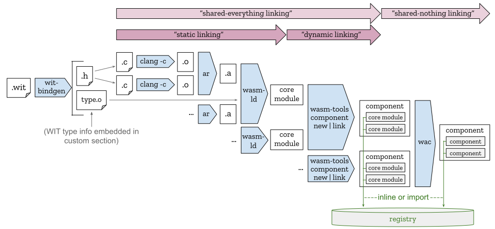

# Component Linking

The Component Model enables multiple complementary forms of linking which allow
producer toolchains to control which Core WebAssembly modules do or don't share
low-level memory. At a high-level, there are two primary forms of linking:
**shared-everything linking** and **shared-nothing linking**:

When two modules are linked together to share Core WebAssembly `memory` and
`table` instances, it is called **shared-everything linking**. In this case,
the linked modules must have been compiled to agree on an implicit toolchain-
or language-defined [ABI]. As an example, two modules compiled against the
[WebAssembly/tool-conventions] C/C++ ABI could be shared-everything-linked
together.

When two modules that have been packaged as components are linked together, it
is not possible for them to share the same `memory` or `table` instances and so
this form of linking is called **shared-nothing linking**. In this case, the
modules need to agree on the component-level types that stand between them,
with each module being allowed to have a *different* ABI for producing and
consuming component-level values of the common component-level types.

A further sub-classification between **dynamic** and **static** is useful when
describing shared-everything linking:

In **shared-everything dynamic linking**, the producer toolchain keeps the Core
WebAssembly modules handed to the runtime separate, thereby allowing the
runtime to more-easily share the compiled machine code of common modules (such
as libc, libpython or libjpeg). Importantly, while this linking is "dynamic"
from the perspective of the producer of the individual modules, the set of
dynamically-linked modules is still *statically* declared to the runtime before
execution, allowing the runtime to perform traditional [AOT compilation] of
each module (separately). (For
[fully-runtime dynamic linking](#fully-runtime-dynamic-linking), see below.)

In **shared-everything static linking**, the producer toolchain eagerly fuses
intermediate units of WebAssembly code together to produce a *single* module
that is handed to the runtime. Since this form of linking is handled by the
producer toolchain, it's completely invisible to the Component Model and the
runtime and thus mostly only relevant when talking about entire end-to-end
workflows (like we'll do next).

Given this terminology, the following diagram shows how the different forms of
linking can be used together in the context of C/C++:
<p align="center"></p>

Digging into the steps of this diagram in more detail:

The process starts by using a tool like [`wit-bindgen`] to generate C headers
that expose core function signatures derived from the [Canonical ABI]. WIT type
information that is needed later to build a component can be stored in a
[custom section] that will be opaquely propagated to the component-specific
tooling by the intervening Core WebAssembly build steps.

Next, each C/C++ translation unit is compiled to a [WebAssembly Object File]
using `clang`, optionally archived together using `ar`, and finally
**shared-everything statically-linked** using [`wasm-ld`], all without any of
these tools knowing about the Component Model.

A single Core WebAssembly module can be trivially wrapped into a component
using a tool like the [`wasm-tools`] `component new` command. Multiple Core
WebAssembly modules can be **shared-everything dynamically-linked** together by
a tool ike the `component link` command, which supports both loading modules into
linear memory automatically (in the style of `ld-linux.so`) or manually (in the
style of `dlopen()`). For a low-level sketch of how dynamic linking works at
the WAT level, see [this example](examples/SharedEverythingDynamicLinking.md).

Lastly, multiple components can be **shared-nothing-linked** together using
language-agnostic composition tools like [`wac`]. Since the output of
composition is itself a component, composite components can themselves be
further composed with other components. For a low-level sketch of how
shared-nothing linking works at the WAT level, see
[this example](examples/LinkTimeVirtualization.md).


## Fully-runtime dynamic linking

While many use cases for dynamic linking are covered by what is described
above, there are still some use cases that require "fully-runtime" dynamic
linking where code is dynamically loaded that was not known (or may not have
even existed) when execution started.

One use case for fully-runtime dynamic linking is JIT compilation (where the
running WebAssembly code generates the bytecode to be linked). This is possible
in browsers today by having WebAssembly call into JS and using the [JS API].
Doing so from pure WebAssembly has been included in Core WebAssembly's list of
[future features][JIT Future Feature] since the beginning of WebAssembly.
This is a nuanced feature for many reasons including the fact that many
WebAssembly execution environments don't provide the raw OS primitives (viz.,
making writable pages executable) to enable a WebAssembly runtime to perform
the native JIT compilation necessary for performance. In any case, addressing
this use case is ideally outside the scope of the Component Model.

Another major use case for fully-runtime dynamic linking is implementing
plugins that can be dynamically selected by WebAssembly code from a large
and/or dynamically-populated store or registry. Such plugin models are
sufficiently diverse (in how plugins are secured, discovered, transported, and
compiled) that it's difficult to design a generic Component Model feature to
support them all well. Based on this, it seems that the right place to
address this use case *above* the Component Model, using an interface defined
in [WIT] and allowing different platforms and applications to tailor the
interface to their needs.

For example, using the Preview 2 feature set of Component Model, a simple
dynamic plugin interface might look like the following:
```wit
interface plugin-loader {
  load: func(name: string) -> plugin;
  resource plugin {
    handle-event: func(event: string, args: list<string>) -> string;
  }
}
```
The expectation here is that, if plugins are implemented by components, the
`plugin` handle returned by `load` points to a component instance created by
the host and the method calls to `handle-event` call exports of that component
instance.

While `plugin-loader` uses generic `string` types in the signature of
`handle-event`, a particular application's plugin interface would naturally be
customized to use whatever WIT types were appropriate, including handles to
application-defined `resource` types. Because the signature of calls into the
plugin are specified statically, a host can separately AOT-compile component
plugins (e.g., on upload to the store or registry) into a native shared object
or DLL that can be efficiently loaded at runtime.

(There are a number of ways to improve upon this basic design with additional
post-Preview 2 features of WIT and the Component Model.)


[ABI]: https://en.wikipedia.org/wiki/Application_binary_interface
[AOT compilation]: https://en.wikipedia.org/wiki/Ahead-of-time_compilation
[WebAssembly/tool-conventions]: https://github.com/WebAssembly/tool-conventions
[WebAssembly Object File]: https://github.com/WebAssembly/tool-conventions/blob/main/Linking.md
[`wit-bindgen`]: https://github.com/bytecodealliance/wit-bindgen
[Canonical ABI]: CanonicalABI.md
[Custom Section]: https://webassembly.github.io/spec/core/binary/modules.html#custom-section
[`wasm-ld`]: https://lld.llvm.org/WebAssembly.html
[`wasm-tools`]: https://github.com/bytecodealliance/wasm-tools#tools-included
[`wac`]: https://github.com/bytecodealliance/wac
[JS API]: https://webassembly.github.io/spec/js-api/index.html
[JIT Future Feature]: https://github.com/WebAssembly/design/blob/main/FutureFeatures.md#platform-independent-just-in-time-jit-compilation
[WIT]: WIT.md
