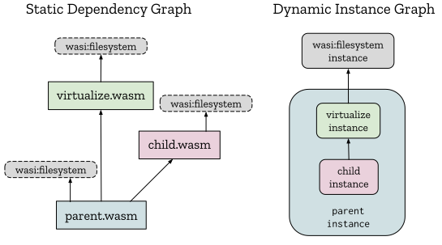

# Link-time Virtualization

The idea with **link-time virtualization** use cases is to take the static
dependency graph on the left (where all 3 components import the
`wasi:filesystem/types` interface) and produce the runtime instance graph on
the right, where the `parent` instance has created a `virtualized` instance and
supplied it to a new `child` instance as the `wasi:filesystem/types`
implementation.

<p align="center"></p>

Importantly, the `child` instance has no access to the `wasi:filesystem`
instance imported by the `parent` instance.

We start with the `child.wat` that has been written and compiled separately,
without regard to `parent.wasm`:
```wasm
;; child.wat
(component
  (import "wasi:filesystem/types" (instance
    (export "read" (func ...))
    (export "write" (func ...))
  ))
  ...
)
```

We want to write a parent component that reuses the child component, giving the
child component a virtual filesystem. This virtual filesystem can be factored
out and reused as a separate component:
```wasm
;; virtualize.wat
(component
  (import "wasi:filesystem/types" (instance $fs
    (export "read" (func ...))
    (export "write" (func ...))
  ))
  (func (export "read")
    ... transitively calls (func $fs "read)
  )
  (func (export "write")
    ... transitively calls (func $fs "write")
  )
)
```

We now write the parent component by composing `child.wasm` with
`virtualize.wasm`:
```wasm
;; parent.wat
(component
  (import "wasi:filesystem/types" (instance $real-fs ...))
  (import "./virtualize.wasm" (component $Virtualize ...))
  (import "./child.wasm" (component $Child ...))
  (instance $virtual-fs (instantiate (component $Virtualize)
    (with "wasi:filesystem/types" (instance $real-fs))
  ))
  (instance $child (instantiate (component $Child)
    (with "wasi:filesystem/types" (instance $virtual-fs))
  ))
)
```
Here we import the `child` and `virtualize` components, but they could also be
trivially copied in-line into the `parent` component using nested component
definitions in place of imports:
```wasm
;; parent.wat
(component
  (import "wasi:filesystem/types" (instance $real-fs ...))
  (component $Virtualize ... copied inline ...)
  (component $Child ... copied inline ...)
  (instance $virtual-fs (instantiate (component $Virtualize)
    (with "wasi:filesystem/types" (instance $real-fs))
  ))
  (instance $child (instantiate (component $Child)
    (with "wasi:filesystem/types" (instance $virtual-fs))
  ))
)
```
