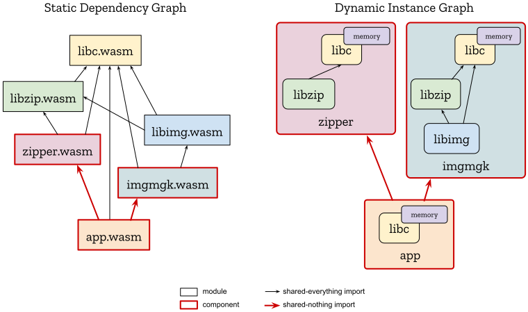

# Shared-Everything Dynamic Linking

*Shared-everything dynamic linking* refers to the ability to create a component
out of multiple Core WebAssembly modules so that common modules can be shared
with other components. This provides an alternative to *static linking* which
forces common code to be copied into each component. This type of linking
should be able to leverage off existing support for native dynamic linking (of
`.dll`s or `.so`s) with a single shared linear memory (hence
*shared-everything* dynamic linking).

Shared-everything dynamic linking should be *complementary* to the
shared-nothing dynamic linking of components described in the
[explainer](../Explainer.md). In particular, dynamically-linked modules must not
share linear memory across component instance boundaries. For example, we want
the static dependency graph on the left to produce the runtime instance graph
on the right:

<p align="center"></p>

Here, `libc` defines and exports a linear memory that is imported by the other
module instances contained within the same component instance. Thus, at
runtime, the composite application creates *three* instances of the `libc`
module (creating *three* linear memories) yet contains only *one* copy of the
`libc` code. This use case is tricky to implement in many module systems where
sharing module code implies sharing module instance state.


## `libc`

As with native dynamic linking, shared-everything dynamic linking requires
toolchain conventions that are followed by all the toolchains producing the
participating modules. Here, as in most conventions, `libc` serves a special
role and is assumed to be bundled with the compiler. As part of this special
role, `libc` defines and exports linear memory, with the convention that
every other module imports memory from `libc`:
```wasm
;; libc.wat
(module
  (memory (export "memory") 1)
  (func (export "malloc") (param i32) (result i32) ...impl)
  ...
)
```

Our compiler will also bundle standard library headers which contain
declarations compatible with `libc`. First, though, we first need some helper
macros, which we'll place in `stddef.h`:
```c
/* stddef.h */
#define WASM_IMPORT(module,name) __attribute__((import_module(#module), import_name(#name))) name
#define WASM_EXPORT(name) __attribute__((export_name(#name))) name
```

These macros use the clang-specific attributes [`import_module`], [`import_name`]
and [`export_name`] to ensure that the annotated C functions produce the
correct wasm import or export definitions. Other compilers would use their own
magic syntax to achieve the same effect. Using these macros, we can declare
`malloc` in `stdlib.h`:
```c
/* stdlib.h */
#include <stddef.h>
#define LIBC(name) WASM_IMPORT(libc, name)
void* LIBC(malloc)(size_t n);
```

With these annotations, C programs that include and call this function will be
compiled to contain the following import:
```wasm
(import "libc" "malloc" (func (param i32) (result i32)))
```


## `libzip`

The interface exposed by `libzip` to its clients is a header file:
```c
/* libzip.h */
#include <stddef.h>
#define LIBZIP(name) WASM_IMPORT(libzip, name)
void* LIBZIP(zip)(void* in, size_t in_size, size_t* out_size);
```
which can be implemented by the following source file:
```c
/* libzip.c */
#include <stdlib.h>
void* WASM_EXPORT(zip)(void* in, size_t in_size, size_t* out_size) {
  ...
  void *p = malloc(n);
  ...
}
```

Note that `libzip.h` annotates the `zip` declaration with an *import* attribute
so that client modules generate proper wasm *import definitions* while `libzip.c`
annotates the `zip` definition with an *export* attribute so that this function
generates a proper *export definition* in the compiled module. Compiling with
`clang -shared libzip.c` produces a module shaped like:
```wasm
;; libzip.wat
(module
  (import "libc" "memory" (memory 1))
  (import "libc" "malloc" (func (param i32) (result i32)))
  (func (export "zip") (param i32 i32 i32) (result i32)
    ...
  )
)
```


## `zipper`

The main module of the `zipper` component is implemented by the following
source file:
```c
/* zipper.c */
#include <stdlib.h>
#include "libzip.h"
int main(int argc, char* argv[]) {
  ...
  void *in = malloc(n);
  ...
  void *out = zip(in, n, &out_size);
  ...
}
```

When compiled by a (future) component-aware `clang`, the resulting component
would look like:
```wasm
;; zipper.wat
(component
  (import "libc" (core module $Libc
    (export "memory" (memory 1))
    (export "malloc" (func (param i32) (result i32)))
  ))
  (import "libzip" (core module $Libzip
    (import "libc" "memory" (memory 1))
    (import "libc" "malloc" (func (param i32) (result i32)))
    (export "zip" (func (param i32 i32 i32) (result i32)))
  ))

  (core module $Main
    (import "libc" "memory" (memory 1))
    (import "libc" "malloc" (func (param i32) (result i32)))
    (import "libzip" "zip" (func (param i32 i32 i32) (result i32)))
    ...
    (func (export "zip") (param i32 i32) (result i32 i32)
      ...
    )
  )

  (core instance $libc (instantiate (module $Libc)))
  (core instance $libzip (instantiate (module $Libzip))
    (with "libc" (instance $libc))
  ))
  (core instance $main (instantiate (module $Main)
    (with "libc" (instance $libc))
    (with "libzip" (instance $libzip))
  ))
  (func $zip (param (list u8)) (result (list u8)) (canon lift
    (core func $main "zip")
    (memory (core memory $libc "memory")) (realloc (func $libc "realloc"))
  ))
  (export "zip" (func $zip))
)
```
Here, `zipper` links its own private module code (`$Main`) with the shareable
`libc` and `libzip` module code, ensuring that each new instance of `zipper`
gets a fresh, private instance of `libc` and `libzip`.


## `libimg`

Next we create a shared module `libimg` that depends on `libzip`:
```c
/* libimg.h */
#include <stddef.h>
#define LIBIMG(name) WASM_IMPORT(libimg, name)
void* LIBIMG(compress)(void* in, size_t in_size, size_t* out_size);
```
```c
/* libimg.c */
#include <stdlib.h>
#include "libzip.h"
void* WASM_EXPORT(compress)(void* in, size_t in_size, size_t* out_size) {
  ...
  void *out = zip(in, in_size, &out_size);
  ...
}
```
Compiling with `clang -shared libimg.c` produces a `libimg` module:
```wat
;; libimg.wat
(module
  (import "libc" "memory" (memory 1))
  (import "libc" "malloc" (func (param i32) (result i32)))
  (import "libzip" "zip" (func (param i32 i32 i32) (result i32)))
  (func (export "compress") (param i32 i32 i32) (result i32)
    ...
  )
)
```


## `imgmgk`

The main module of the `imgmgk` component is implemented by including
`stddef.h`, `libzip.h` and `libimg.h`. When compiled by a (future)
component-aware `clang`, the resulting component would look like:
```wasm
;; imgmgk.wat
(component $Imgmgk
  (import "libc" (core module $Libc ...))
  (import "libzip" (core module $Libzip ...))
  (import "libimg" (core module $Libimg ...))

  (core module $Main
    (import "libc" "memory" (memory 1))
    (import "libc" "malloc" (func (param i32) (result i32)))
    (import "libimg" "compress" (func (param i32 i32 i32) (result i32)))
    ...
    (func (export "transform") (param i32 i32) (result i32 i32)
      ...
    )
  )

  (core instance $libc (instantiate (module $Libc)))
  (core instance $libzip (instantiate (module $Libzip)
    (with "libc" (instance $libc))
  ))
  (core instance $libimg (instantiate (module $Libimg)
    (with "libc" (instance $libc))
    (with "libzip" (instance $libzip))
  ))
  (core instance $main (instantiate (module $Main)
    (with "libc" (instance $libc))
    (with "libimg" (instance $libimg))
  ))
  (func $transform (param (list u8)) (result (list u8)) (canon lift
    (core func $main "transform")
    (memory (core memory $libc "memory")) (realloc (func $libc "realloc"))
  ))
  (export "transform" (func $transform))
)
```
Here, we see the general pattern emerging of the dependency DAG between
dynamically-linked modules expressed through `instance` definitions.


## `app`

Finally, we can create the `app` component by composing the `zipper` and `imgmgk`
components. The resulting component could look like:
```wasm
;; app.wat
(component
  (import "libc" (core module $Libc ...))
  (import "libzip" (core module $Libzip ...))
  (import "libimg" (core module $Libimg ...))

  (import "zipper" (component $Zipper ...))
  (import "imgmgk" (component $Imgmgk ...))

  (core module $Main
    (import "libc" "memory" (memory 1))
    (import "libc" "malloc" (func (param i32) (result i32)))
    (import "zipper" "zip" (func (param i32 i32) (result i32 i32)))
    (import "imgmgk" "transform" (func (param i32 i32) (result i32 i32)))
    ...
    (func (export "run") (param i32 i32) (result i32 i32)
      ...
    )
  )

  (instance $zipper (instantiate (component $Zipper)
    (with "libc" (module $Libc))
    (with "libzip" (module $Libzip))
  ))
  (instance $imgmgk (instantiate (component $Imgmgk)
    (with "libc" (module $Libc))
    (with "libzip" (module $Libzip))
    (with "libimg" (module $Libimg))
  ))

  (core instance $libc (instantiate (module $Libc)))
  (core func $zip (canon lower
    (func $zipper "zip")
    (memory (core memory $libc "memory")) (realloc (func $libc "realloc"))
  ))
  (core func $transform (canon lower
    (func $imgmgk "transform")
    (memory (core memory $libc "memory")) (realloc (func $libc "realloc"))
  ))
  (core instance $main (instantiate (module $Main)
    (with "libc" (instance $libc))
    (with "zipper" (instance (export "zip" (func $zipper "zip"))))
    (with "imgmgk" (instance (export "transform" (func $imgmgk "transform"))))
  ))
  (func $run (param string) (result string) (canon lift
    (core func $main "run")
    (memory (core memory $libc "memory")) (realloc (func $libc "realloc"))
  ))
  (export "run" (func $run))
)
```
Note here that `$Libc` is passed to the nested `zipper` and `imgmgk` instances
as an (uninstantiated) module before `app` creates its own private instance
of `libc` linked with its private `$Main` module instance. Thus, the three
components share `libc` *code* without sharing `libc` *state*, realizing the
instance diagram at the beginning.


## Cyclic Dependencies

If cyclic dependencies are necessary, such cycles can be broken by:
* identifying a [spanning] DAG over the module dependency graph;
* keeping the calls along the spanning DAG's edges as normal function imports
  and direct calls (as shown above); then
* converting calls along "back edges" into indirect calls (`call_indirect`) of
  an imported `(global i32)` containing the index in the function table.

For example, a cycle between modules `$A` and `$B` could be broken by arbitrarily
saying that `$B` gets to directly import `$A` and then routing `$A`'s imports
through a shared mutable `funcref` table via `call_indirect`:
```wat
(module $A
  ;; A imports B.bar indirectly via table+index
  (import "linkage" "table" (table funcref))
  (import "linkage" "bar-index" (global $bar-index (mut i32)))

  (type $FooType (func))
  (func $some_use
    (call_indirect $FooType (global.get $bar-index))
  )

  ;; A exports A.foo directly to B
  (func (export "foo")
    ...
  )
)
```
```wat
(module $B
  ;; B directly imports A.foo
  (import "a" "foo" (func $a_foo))  ;; B gets to directly import A

  ;; B indirectly exports B.bar to A
  (func $bar ...)
  (import "linkage" "table" (table $ftbl funcref))
  (import "linkage" "bar-index" (global $bar-index (mut i32)))
  (elem (table $ftbl) (offset (i32.const 0)) $bar)
  (func $start (global.set $bar-index (i32.const 0)))
  (start $start)
)
```
Lastly, a toolchain can link these together into a whole program by emitting
a wrapper adapter module that supplies both `$A` and `$B` with a shared
function table and `bar-index` mutable global.
```wat
(component
  (import "A" (core module $A ...))
  (import "B" (core module $B ...))
  (core module $Linkage
    (global (export "bar-index") (mut i32))
    (table (export "table") funcref 1)
  )
  (core instance $linkage (instantiate (module $Linkage)))
  (core instance $a (instantiate (module $A)
    (with "linkage" (instance $linkage))
  ))
  (core instance $b (instantiate (module $B)
    (import "a" (instance $a))
    (with "linkage" (instance $linkage))
  ))
)
```


## Function Pointer Identity

To ensure C function pointer identity across shared libraries, for each exported
function, a shared library will need to export both the `func` definition and a
`(global (mut i32))` containing that `func`'s index in the global `funcref` table.

Because a shared library can't know the absolute offset in the global `funcref`
table for all of its exported functions, the table slots' offsets must be
dynamic. One way this could be achieved is by the shared library calling into a
`ftalloc` export of `libc` (analogous to `malloc`, but for allocating from the
global `funcref` table) from the shared library's `start` function. Elements could
then be written into the table at the allocated offset and their indices
written into the exported `(global (mut i32))`s.

(In theory, more efficient schemes are possible when the main program has more
static knowledge of its shared libraries.)


## Linear-memory stack pointer

To implement address-taken local variables, varargs, and other corner cases,
wasm compilers maintain a stack in linear memory that is maintained in
lock-step with the native WebAssembly stack. The pointer to the top of the
linear-memory stack is usually maintained in a single `(global (mut i32))`
variable that must be shared by all linked instances. Following the above
linking scheme, this global would naturally be exported by `libc` along
with linear memory.


## Runtime Dynamic Linking

The general case of runtime dynamic linking in the style of `dlopen`, where an
*a priori unknown* module is linked into the program at runtime, is not possible
to do purely within wasm with this proposal. Additional host-provided APIs are
required for:
* compiling files or bytes into a module;
* reading the import strings of a module;
* dynamically instantiating a module given a list of import values; and
* dynamically extracting the exports of an instance.

Such APIs could be standardized as part of [WASI]. Moreover, the [JS API]
possesses all the above capabilities allowing the WASI APIs to be prototyped and
implemented in the browser.


[`import_module`]: https://clang.llvm.org/docs/AttributeReference.html#import-module
[`import_name`]: https://clang.llvm.org/docs/AttributeReference.html#import-name
[`export_name`]: https://clang.llvm.org/docs/AttributeReference.html#export-name
[Spanning]: https://en.wikipedia.org/wiki/Spanning_tree
[WASI]: https://github.com/webassembly/wasi
[JS API]: https://webassembly.github.io/spec/js-api/index.html
